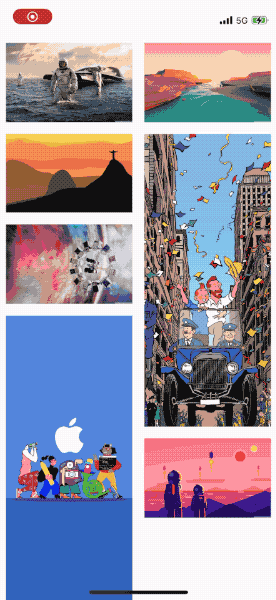

# HBWaterFall

[](https://travis-ci.org/haoboxuxu/HBWaterFall)
[](https://cocoapods.org/pods/HBWaterFall)
[](https://cocoapods.org/pods/HBWaterFall)
[](https://cocoapods.org/pods/HBWaterFall)

## Demo



## Example

To run the example project, clone the repo, and run `pod install` from the Example directory first.

Here is qucik setup.(for more info, clone the repo and run the example app)

```swift
// prepare your data model
struct Item {
  ...
}
In ViewController
class ViewController: UIViewController {
  // add a HBWaterFallView
  var wfView = HBWaterFallView()
  ...

	override func viewDidLoad() {
    		...
        // register your cell
        wfView.register(DemoCell.self, forCellWithReuseIdentifier: DemoCell.identifier)
	    	// conform to delegates and dataSource
        wfView.delegate = self
        wfView.dataSource = self
        
		    // config your layout(optional)
        let layout = HBWaterFallLayout()
        layout.delegate = self
        layout.interItemSpacing = 5
        layout.numOfItemPerRow = 2
        wfView.waterFallLayout = layout
        
        view.addSubview(wfView)
    }
}
```

```swift
// you may want to do some setup in delegates
extension ViewController: UICollectionViewDelegate, UICollectionViewDataSource, HBWaterFallLayoutDelegate {
  //numberOfItemsInSection
  //cellForItemAt
  //sizeOfCellAtIndexPath(HBWaterFallLayoutDelegate)
}
```


## Requirements

## Installation

HBWaterFall is available through [CocoaPods](https://cocoapods.org). To install
it, simply add the following line to your Podfile:

```ruby
pod 'HBWaterFall'
```

## Author

haoboxuxu, haoboxuxu@icloud.com

## License

HBWaterFall is available under the MIT license. See the LICENSE file for more info.
